# Service Architecture + UML (Mermaid) cho BookStore Microservices

Tập tin này mô tả kiến trúc từng dịch vụ kèm mã Mermaid UML có thể dùng trực tiếp trong GitHub/GitLab hoặc các công cụ hỗ trợ Mermaid.

## 1. API Gateway

```mermaid
flowchart LR
  Client -->|HTTP /api/*| Gateway[API Gateway]\n  Gateway --> Customer[customer-service]
  Gateway --> Staff[staff-service]
  Gateway --> Book[book-service]
  Gateway --> Cart[cart-service]
  Gateway --> Order[order-service]
  Gateway --> Pay[pay-service]
  Gateway --> Ship[ship-service]
  Gateway --> Review[comment-rate-service]
  Gateway --> Manager[manager-service]
  Gateway --> Catalog[catalog-service]
  Gateway --> Recommender[recommender-ai-service]
```

## 2. Customer Service (Identity)

### 2.1 Class Diagram

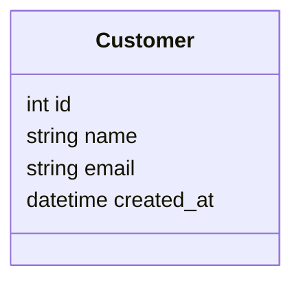

### 2.2 Key APIs (FR1)

- POST `/api/customers/` - tạo Customer và gọi Cart Service `/api/cart/create/`.
- GET `/api/customers/`.
- GET `/api/customers/<id>/`.

### 2.3 Sequence (FR1)

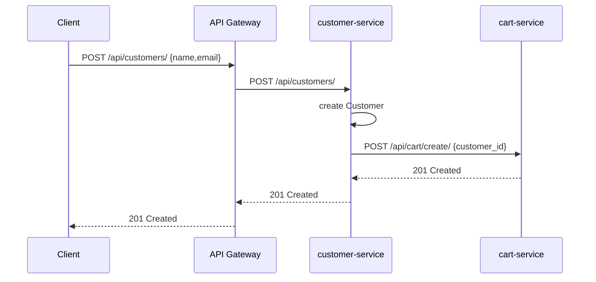

## 3. Book Service (Catalog core)

### 3.1 Class Diagram

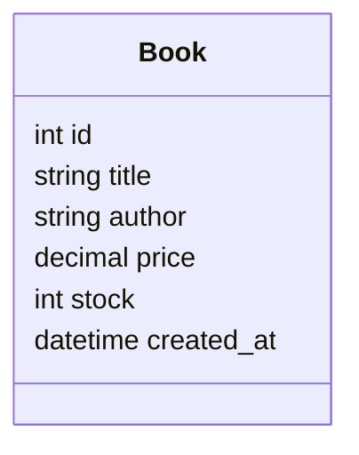

### 3.2 Key APIs

- GET `/api/books/`
- GET `/api/books/<id>/`
- GET `/api/books/batch/?ids=...` (cart-service, order-service dùng)
- POST/PUT/DELETE `/api/books/` (staff-service proxy)

## 4. Staff Service

### 4.1 Architecture

staff-service không có DB riêng cho sách, proxy qua book-service.

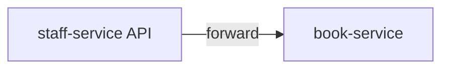

### 4.2 Key APIs (FR2)

- GET/POST/PUT/DELETE `/api/staff/books/` (proxy sang book-service, cho quản lý sách)

## 5. Cart Service

### 5.1 Class Diagram

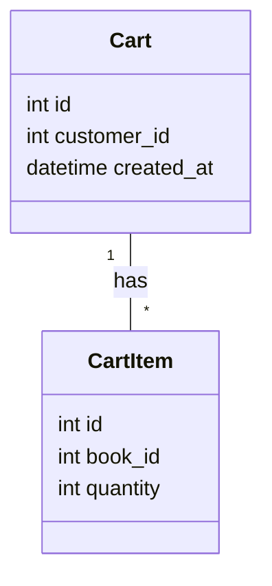

### 5.2 Key APIs (FR3)

- POST `/api/cart/create/`
- POST `/api/cart/add/<customer_id>/`
- GET `/api/cart/view/<customer_id>/`
- PATCH `/api/cart/update/<customer_id>/<item_id>/`
- DELETE `/api/cart/remove/<customer_id>/<item_id>/`
- GET `/api/cart/by-customer/<customer_id>/` (order-service)

### 5.3 Sequence: Thêm sách vào giỏ

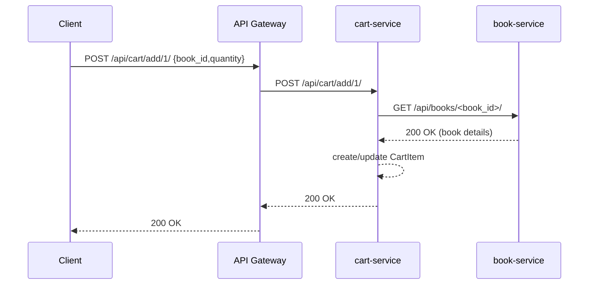

## 6. Order Service

### 6.1 Class Diagram

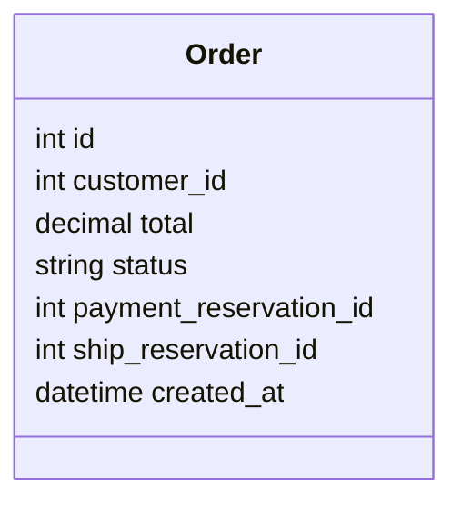

### 6.2 Key APIs (FR4 Saga)

- POST `/api/orders/create/`
- GET `/api/orders/?customer_id=...`

### 6.3 Saga Sequence

```mermaid
sequenceDiagram
    participant C as Client
    participant G as API Gateway
    participant O as order-service
    participant Cart as cart-service
    participant Book as book-service
    participant Pay as pay-service
    participant Ship as ship-service

    C->>G: POST /api/orders/create/ {customer_id,address}
    G->>O: POST /api/orders/create/
    O->>Cart: GET /api/cart/by-customer/<customer_id>/
    Cart-->>O: Cart + items
    O->>Book: GET /api/books/batch/?ids=...
    Book-->>O: Book details
    O-->>O: compute total; create Order pending
    O->>Pay: POST /api/pay/reserve/ {order_id,amount}
    Pay-->>O: 201 reserved
    O->>Ship: POST /api/ship/reserve/ {order_id,address}
    Ship-->>O: 201 reserved
    O-->>O: update Order completed
    O-->>G: 201 order created
    G-->>C: 201 order created
```

### 6.4 Saga compensation (fail)

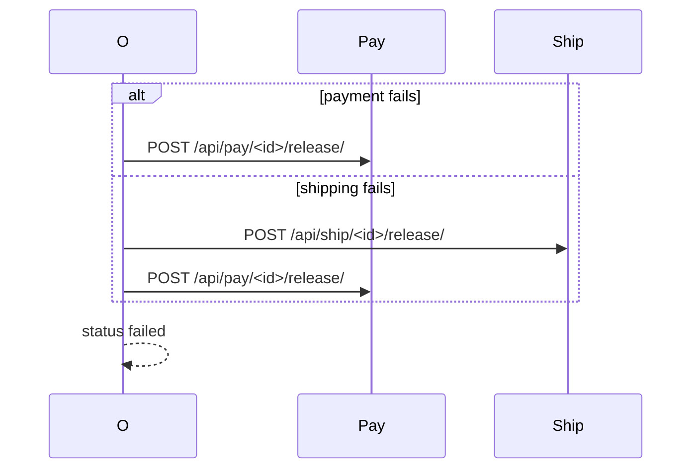

## 7. Pay Service

### 7.1 Class Diagram

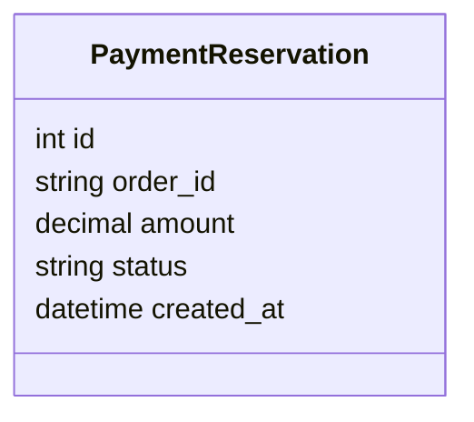

### 7.2 APIs

- POST `/api/pay/reserve/`
- POST `/api/pay/<id>/release/`

## 8. Ship Service

### 8.1 Class Diagram

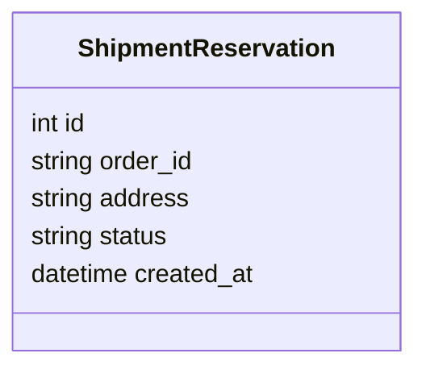

### 8.2 APIs

- POST `/api/ship/reserve/`
- POST `/api/ship/<id>/release/`

## 9. Comment-Rate Service

### 9.1 Class Diagram

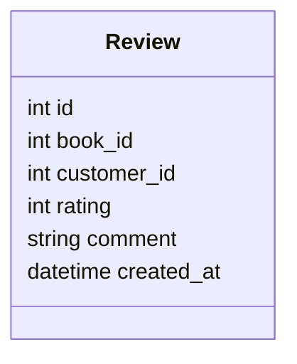

### 9.2 APIs (FR5)

- POST `/api/reviews/rate/`
- GET `/api/reviews/book/<book_id>/`

## 10. Catalog Service

- Proxy GET `/api/catalog/books/` sang book-service `/api/books/`.
- Không có DB riêng, chỉ làm aggregation.

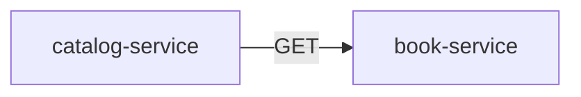

## 11. Manager Service

- REST API hiển thị dashboard dữ liệu tổng hợp bằng cách gọi các service khác.

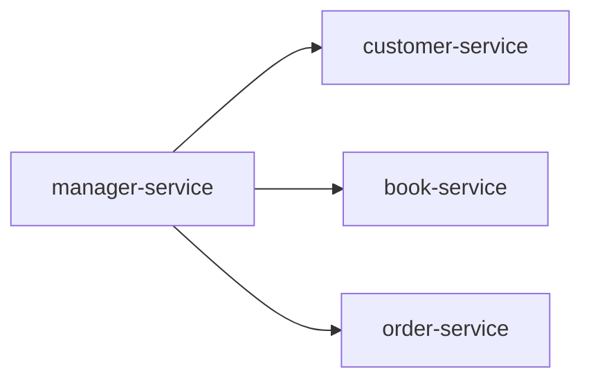

## 12. Recommender Service

- API gợi ý sách (dựa trên top N từ book-service).

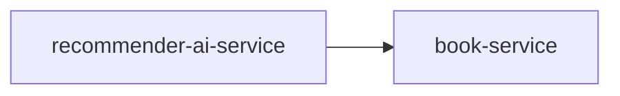
